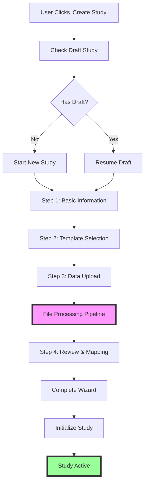
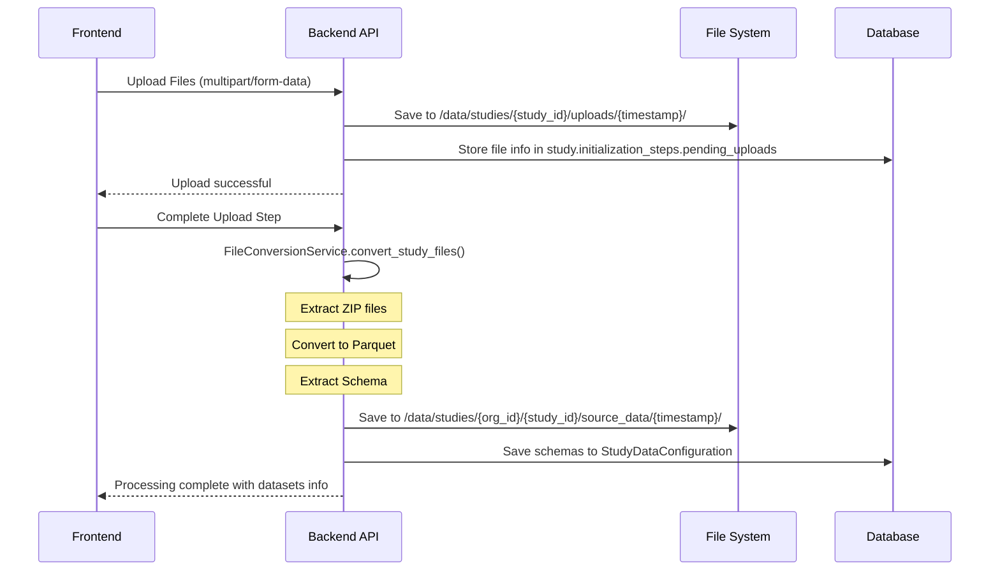
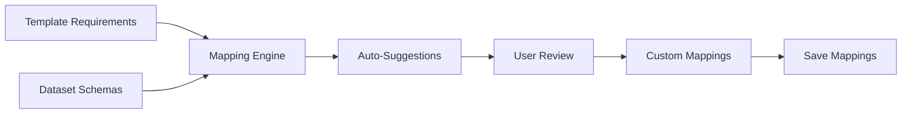
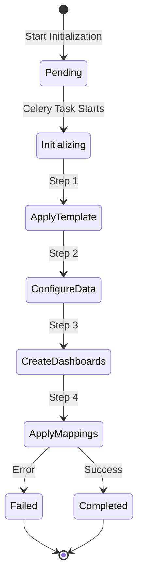
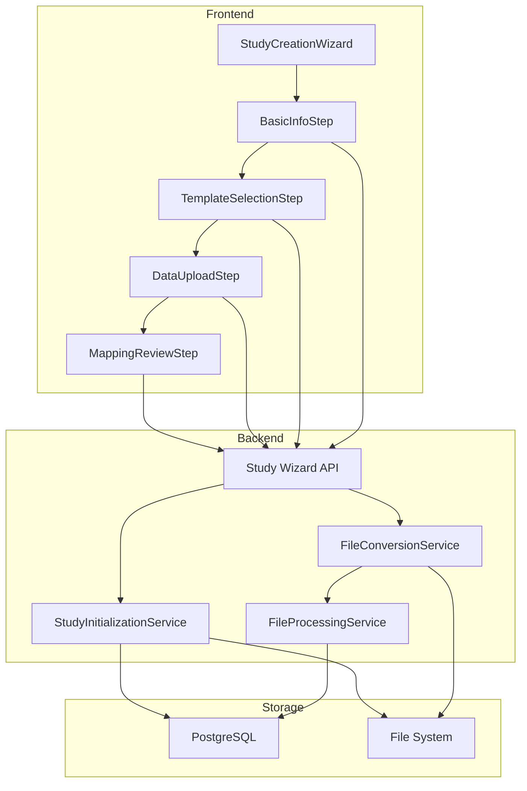

# Complete Study Creation Flow - From Click to Completion

## Overview
This document details every step in the study creation process, from the moment a user clicks "Create Study" to the final activated study with data loaded and dashboards ready.

## High-Level Flow Diagram



## Detailed Step-by-Step Process

### Step 0: Pre-Creation Check
```
URL: /studies/new
Component: StudyCreationWizard
```

1. **Check for Draft Study**
   ```
   GET /api/v1/studies/wizard/check-draft
   ```
   - Checks if user has any draft studies (status = "DRAFT")
   - If yes, offers to resume or start fresh
   - If no, proceeds to Step 1

### Step 1: Basic Information Collection
```
Component: BasicInfoStep
API Endpoint: POST /api/v1/studies/wizard/start
```

**User Inputs:**
- Study Name
- Protocol Number (must be unique)
- Description (optional)
- Phase (dropdown: Phase 1-4, Observational, Expanded Access)
- Therapeutic Area (optional)
- Indication (optional)

**Backend Process:**
1. Validates protocol number uniqueness
2. Creates study record with:
   - status: "draft"
   - initialization_status: "wizard_in_progress"
   - org_id: from current user
   - study_code: auto-generated from name
3. Sets wizard_state.current_step = 2
4. Returns study_id for subsequent steps

### Step 2: Template Selection
```
Component: TemplateSelectionStep
API Endpoints: 
- GET /api/v1/studies/wizard/{study_id}/templates
- POST /api/v1/studies/wizard/{study_id}/select-template
```

**Process:**
1. **Fetch Available Templates**
   - Gets all active templates with status = "published"
   - Counts widgets, dashboards, menu items for each
   - Marks recommendations based on study phase

2. **Template Display**
   - Shows template cards with:
     - Name & Description
     - Widget/Dashboard counts
     - Preview button
     - "Recommended" badge if applicable

3. **Selection & Save**
   - Updates study.dashboard_template_id
   - Sets template_applied_at timestamp
   - Updates wizard_state.current_step = 3

### Step 3: Data Upload
```
Component: DataUploadStep
API Endpoints:
- POST /api/v1/studies/{study_id}/initialize/upload
- POST /api/v1/studies/wizard/{study_id}/complete-upload
```

**Upload Process:**



**Detailed File Processing Pipeline:**

1. **File Upload**
   - Accepts: CSV, Excel (.xlsx, .xls), SAS (.sas7bdat, .xpt), ZIP
   - Stores temporarily in uploads folder
   - Updates pending_uploads in initialization_steps

2. **File Conversion (NEW - Comprehensive Pipeline)**
   ```python
   FileConversionService.convert_study_files():
   ```
   
   a. **ZIP Extraction**
      - Creates temp extraction folder
      - Extracts all data files
      - Flattens directory structure
      - Handles duplicate names
   
   b. **Format Conversion**
      - CSV → Parquet (with encoding detection)
      - Excel → Parquet (supports both .xls and .xlsx)
      - SAS7BDAT → Parquet (preserves metadata)
      - XPT → Parquet (preserves metadata)
   
   c. **Schema Extraction**
      - Reads parquet files
      - Extracts column metadata:
        - Data types (string, number, datetime, boolean)
        - Null counts
        - Unique values (for categorical)
        - Statistics (for numeric)
        - Sample data (first 5 rows)
   
   d. **Folder Organization**
      ```
      /data/studies/{org_id}/{study_id}/source_data/{YYYYMMDD_HHMMSS}/
      ├── demographics.parquet
      ├── demographics_metadata.json (for SAS files)
      ├── adverse_events.parquet
      ├── laboratory.parquet
      └── ...
      ```

3. **Progress Tracking**
   - Updates study.initialization_progress (0-100%)
   - Logs each step: "Extracting...", "Converting...", "Extracting schema..."
   - Could be exposed via WebSocket for real-time UI updates

4. **Schema Storage**
   - Creates/updates StudyDataConfiguration record
   - Stores complete dataset schemas with column details
   - Generates mapping suggestions based on template requirements

### Step 4: Review & Mapping
```
Component: MappingReviewStep
API Endpoints:
- GET /api/v1/studies/wizard/{study_id}/mapping-data
- POST /api/v1/studies/wizard/{study_id}/complete
```

**Mapping Process:**



1. **Fetch Mapping Data**
   - Template requirements (from widget configurations)
   - Dataset schemas (from processed files)
   - Auto-generated mapping suggestions

2. **Mapping Algorithm**
   ```
   For each widget requirement:
   - Exact name match (score: 1.0)
   - CDISC standard mapping (score: 0.9)
   - Partial match (score: 0.7)
   - Type compatibility check
   - Returns best match with confidence score
   ```

3. **User Interface**
   - Shows each widget's data requirements
   - Displays suggested mappings with confidence
   - Allows manual override
   - Preview of mapped data

4. **Completion**
   - Saves field_mappings to study
   - Updates status from "draft" to "SETUP"
   - Sets initialization_status = "wizard_completed"

### Step 5: Study Initialization (Post-Wizard)
```
API Endpoint: POST /api/v1/studies/{study_id}/initialize
Background Task: Celery
```

**Initialization Process:**



1. **Template Application**
   - Creates dashboard instances from template
   - Sets up menu structure
   - Configures widget instances

2. **Data Configuration**
   - Sets up data source connections
   - Configures refresh schedules
   - Validates data access

3. **Dashboard Creation**
   - Instantiates each dashboard page
   - Places widgets according to template
   - Applies custom configurations

4. **Mapping Application**
   - Connects widgets to data columns
   - Sets up data transformations
   - Validates all mappings

### Final State: Active Study

```
Study Status: "active"
Initialization Status: "completed"
```

**Available Features:**
- View dashboards with real data
- Data automatically refreshed per schedule
- All widgets connected to proper data sources
- Audit trail tracking all activities
- Export capabilities enabled

## Database State Changes

```sql
-- Initial Creation (Step 1)
Study:
  status: "draft"
  initialization_status: "wizard_in_progress"
  initialization_steps: {
    wizard_state: { current_step: 1 }
  }

-- After Template Selection (Step 2)
Study:
  dashboard_template_id: <selected_template_id>
  template_applied_at: <timestamp>
  initialization_steps.wizard_state.current_step: 3

-- After Data Upload (Step 3)
Study:
  data_uploaded_at: <timestamp>
  initialization_steps: {
    pending_uploads: [...files],
    file_processing: {...results},
    data_folder: "/data/studies/{org_id}/{study_id}/source_data/{timestamp}/"
  }
StudyDataConfiguration:
  dataset_schemas: {...extracted schemas}

-- After Mapping (Step 4)
Study:
  status: "SETUP"
  field_mappings: {...user mappings}
  mappings_configured_at: <timestamp>
  initialization_status: "wizard_completed"

-- After Initialization (Step 5)
Study:
  status: "active"
  initialization_status: "completed"
  activated_at: <timestamp>
```

## Error Handling & Recovery

1. **Draft Recovery**
   - Can resume from any step
   - State preserved in initialization_steps
   - "Cancel" option to delete draft

2. **Upload Failures**
   - Individual file errors don't stop process
   - Errors reported in results
   - Can re-upload failed files

3. **Initialization Failures**
   - Can retry failed initialization
   - Detailed error logging
   - Rollback capabilities

## Key Components Interaction



## Summary

The complete flow involves:
1. **4 Wizard Steps** in the UI
2. **8 API Endpoints** for wizard operations
3. **3 Major Services** for processing
4. **2 Storage Systems** (DB + Files)
5. **Multiple State Transitions** tracked in database

The new comprehensive file processing ensures:
- Proper folder structure organization
- All files converted to efficient Parquet format
- Complete schema extraction for mapping
- Progress tracking throughout
- Error handling and recovery options