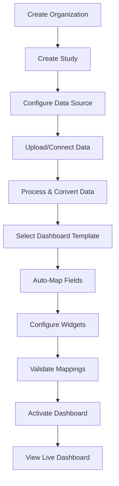

# Complete Study Dashboard Creation Process

## 🎯 Overview
This document outlines the complete end-to-end process for creating a study dashboard in the Clinical Dashboard Platform, from initial study creation to viewing live data.

---

## 📋 Process Flow



---

## 🔄 Detailed Step-by-Step Process

### **Step 1: Organization Setup** (One-time)
**Location:** `/organizations/new`
**Purpose:** Create the parent organization for studies

1. **Create Organization**
   - Organization Name
   - Organization Code
   - Contact Information
   - Compliance Settings (21 CFR Part 11)

2. **Assign Admin Users**
   - Organization Admin
   - Study Managers
   - Data Managers

---

### **Step 2: Study Creation**
**Location:** `/studies/new`
**Purpose:** Define the clinical study

1. **Basic Study Information**
   ```
   - Study Name: "COVID-19 Vaccine Phase 3"
   - Protocol Number: "COV-VAC-P3-001"
   - Study Phase: Phase 3
   - Therapeutic Area: Vaccines
   - Target Enrollment: 5000
   - Number of Sites: 50
   ```

2. **Study Status**
   - Initially set to `DRAFT`
   - Changes to `ACTIVE` after data configuration

---

### **Step 3: Data Source Configuration**
**Location:** Study Settings → Data Sources
**Purpose:** Define how data will be acquired

#### **Option A: Medidata Rave API**
```json
{
  "type": "medidata_api",
  "config": {
    "base_url": "https://api.mdsol.com",
    "study_oid": "COV-VAC-P3",
    "username": "api_user",
    "password": "encrypted_password",
    "datasets": ["DM", "AE", "LB", "VS"]
  },
  "refresh_schedule": "0 6 * * *"  // Daily at 6 AM
}
```

#### **Option B: Veeva Vault API**
```json
{
  "type": "veeva_vault",
  "config": {
    "vault_url": "https://mycompany.veevavault.com",
    "study_id": "VS-2024-001",
    "username": "vault_user",
    "password": "encrypted_password"
  },
  "refresh_schedule": "0 */4 * * *"  // Every 4 hours
}
```

#### **Option C: Manual Upload**
```json
{
  "type": "zip_upload",
  "config": {
    "allowed_formats": ["sas7bdat", "csv", "xpt"],
    "validation_rules": {
      "required_files": ["dm", "ae"],
      "max_file_size_mb": 500
    }
  }
}
```

---

### **Step 4: Data Upload/Connection**
**Location:** Study Initialization Wizard
**Purpose:** Get data into the system

#### **For Manual Upload:**
1. **Upload Files**
   - Drag & drop SAS/CSV files
   - Files uploaded to: `/data/{org_id}/studies/{study_id}/source_data/{date}/`
   
2. **File Examples:**
   ```
   ae.sas7bdat     - Adverse Events (111MB)
   dm.sas7bdat     - Demographics (5MB)
   ds.sas7bdat     - Disposition (1.8MB)
   lb.sas7bdat     - Laboratory Results
   vs.sas7bdat     - Vital Signs
   ```

#### **For API Connection:**
1. **Test Connection**
2. **Select Datasets**
3. **Initial Sync**

---

### **Step 5: Data Processing**
**Backend Process:** Automatic
**Purpose:** Convert and optimize data

1. **File Conversion Pipeline**
   ```python
   SAS/CSV → Pandas DataFrame → Parquet Files
   ```

2. **Storage Decision Tree**
   ```
   IF rows < 10,000:     PostgreSQL (JSONB)
   IF rows < 100,000:    PostgreSQL + Redis Cache
   IF rows > 100,000:    Parquet + DuckDB
   ```

3. **Metadata Extraction**
   - Row count
   - Column names & types
   - Detected patterns (CDISC/EDC)
   - Data quality metrics

---

### **Step 6: Dashboard Template Selection**
**Location:** Template Gallery
**Purpose:** Choose pre-built dashboard layout

**Available Templates:**
1. **Safety Dashboard**
   - SAE Summary KPI
   - AE Distribution Chart
   - Timeline of Events
   - Site Safety Metrics

2. **Enrollment Dashboard**
   - Enrollment Rate KPI
   - Site Performance
   - Demographic Distribution
   - Recruitment Timeline

3. **Data Quality Dashboard**
   - Query Rate KPI
   - Missing Data Heat Map
   - Protocol Deviations
   - Data Entry Timeliness

---

### **Step 7: Auto-Mapping Process**
**Backend Process:** Automatic with Manual Override
**Purpose:** Map data fields to widget requirements

1. **EDC System Detection**
   ```python
   # System automatically detects:
   if "USUBJID" in columns:
       system = "Medidata Rave (CDISC)"
   elif "subject_id" in columns:
       system = "Veeva Vault"
   ```

2. **Pattern Recognition**
   ```python
   # Auto-maps with confidence scores:
   "USUBJID" → subject_id (95% confidence)
   "AESER" → serious_ae_flag (90% confidence)
   "AESTDTC" → ae_start_date (85% confidence)
   ```

3. **Manual Adjustment** (if needed)
   - Review auto-mappings
   - Adjust incorrect mappings
   - Save as template for reuse

---

### **Step 8: Widget Configuration**
**Location:** Dashboard Designer
**Purpose:** Configure individual widgets

#### **Example: Enrollment Rate KPI Widget**
```json
{
  "widget_type": "kpi_card",
  "title": "Enrollment Rate",
  "data_config": {
    "dataset": "demographics",
    "metric_type": "enrollment_rate",
    "filters": {
      "RANDFL": "Y"  // Randomized flag
    },
    "calculation": "COUNT(USUBJID) / DAYS_IN_STUDY"
  },
  "display_config": {
    "color": "primary",
    "show_trend": true,
    "refresh_interval": 30
  }
}
```

#### **Example: SAE Count Widget**
```json
{
  "widget_type": "kpi_card",
  "title": "Serious Adverse Events",
  "data_config": {
    "dataset": "adverse_events",
    "metric_type": "sae_count",
    "filters": {
      "AESER": "Y"
    }
  }
}
```

---

### **Step 9: Validation**
**Location:** Preview Mode
**Purpose:** Ensure everything works

1. **Data Validation**
   - ✅ All required fields mapped
   - ✅ Data types compatible
   - ✅ Calculations valid

2. **Widget Preview**
   - Live data preview
   - Sample calculations
   - Error checking

3. **Performance Check**
   - Query execution time
   - Data freshness
   - Cache effectiveness

---

### **Step 10: Dashboard Activation**
**Location:** Study Settings
**Purpose:** Go live with dashboard

1. **Final Checklist**
   - ✅ Data source connected
   - ✅ Data processed successfully
   - ✅ All widgets configured
   - ✅ Mappings validated
   - ✅ User permissions set

2. **Activation**
   ```
   Study Status: DRAFT → ACTIVE
   Dashboard Status: CONFIGURATION → LIVE
   ```

---

### **Step 11: Live Dashboard**
**Location:** `/dashboard/{study_id}`
**Purpose:** View real-time clinical data

**Dashboard Features:**
- Real-time KPI updates
- Interactive charts
- Data export options
- Scheduled reports
- Audit trail

---

## 🔄 Data Refresh Cycle

### **Automated Refresh (API Sources)**
```
Every 4 hours:
1. Check for new data
2. Download updates
3. Process & convert
4. Update dashboards
5. Send notifications
```

### **Manual Refresh (Upload Sources)**
```
Admin uploads new files:
1. Upload notification
2. File validation
3. Process & convert
4. Dashboard refresh
5. Audit log entry
```

---

## 🎨 Dashboard Components

### **Available Widget Types**
1. **KPI Metric Card**
   - Single metric display
   - Trend indicators
   - Comparison values

2. **Time Series Chart**
   - Line/Area charts
   - Date-based analysis
   - Multiple series support

3. **Distribution Chart**
   - Bar/Pie charts
   - Categorical analysis
   - Demographic breakdowns

4. **Data Table**
   - Sortable columns
   - Filtering
   - Export to Excel

5. **Heat Map**
   - Site performance
   - Data quality metrics
   - Geographic distribution

---

## 🔐 Security & Compliance

### **Data Security**
- Encrypted storage
- API credentials encrypted
- Row-level security
- Audit trail for all actions

### **21 CFR Part 11 Compliance**
- Electronic signatures
- Audit trails
- Access controls
- Data integrity checks

---

## 📊 Current Implementation Status

### **✅ Completed Features**
- Organization & Study creation
- Data source configuration (all 3 types)
- File upload & processing
- SAS to Parquet conversion
- Auto-mapping with EDC detection
- KPI widget with real data
- Dashboard templates
- Refresh scheduling

### **🚧 In Progress**
- Live Medidata Rave API integration
- Live Veeva Vault API integration
- Additional widget types
- Advanced visualizations

### **📋 Planned Features**
- Custom widget builder
- Advanced analytics
- Predictive insights
- Mobile app support

---

## 🚀 Quick Start Guide

### **For a New Study:**

1. **Create Study**
   ```bash
   POST /api/v1/studies/
   {
     "name": "My Clinical Trial",
     "protocol_number": "MCT-001"
   }
   ```

2. **Configure Data Source**
   ```bash
   POST /api/v1/data-sources/
   {
     "study_id": "{study_id}",
     "type": "zip_upload"
   }
   ```

3. **Upload Data**
   ```bash
   POST /api/v1/data-uploads/studies/{study_id}/uploads
   Form Data:
   - file: ae.sas7bdat
   - upload_name: "Adverse Events"
   ```

4. **Apply Template**
   ```bash
   POST /api/v1/studies/{study_id}/apply-template
   {
     "template_id": "safety_dashboard_v1"
   }
   ```

5. **View Dashboard**
   ```
   Navigate to: /dashboard/{study_id}
   ```

---

## 📝 Example Timeline

**Day 1: Setup**
- Create organization (5 min)
- Create study (5 min)
- Configure data source (10 min)

**Day 2: Data**
- Upload SAS files (15 min)
- Data processing (automatic, 5-30 min)
- Review auto-mappings (10 min)

**Day 3: Dashboard**
- Select template (5 min)
- Configure widgets (20 min)
- Validate & activate (10 min)

**Total Time: ~2 hours active work**

---

## 🎯 Success Metrics

- **Data Upload → Dashboard:** < 1 hour
- **Auto-mapping Accuracy:** > 90%
- **Query Performance:** < 2 seconds
- **Data Refresh:** < 5 minutes
- **User Satisfaction:** > 4.5/5

---

## 📞 Support

For issues or questions:
- Technical Support: support@sagarmatha.ai
- Documentation: /docs
- API Reference: /api/docs
- Video Tutorials: /tutorials